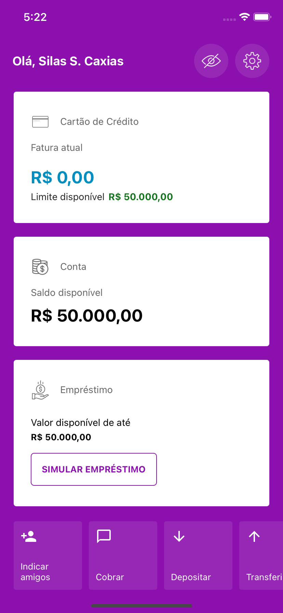
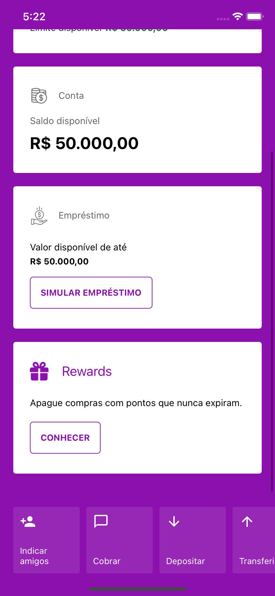
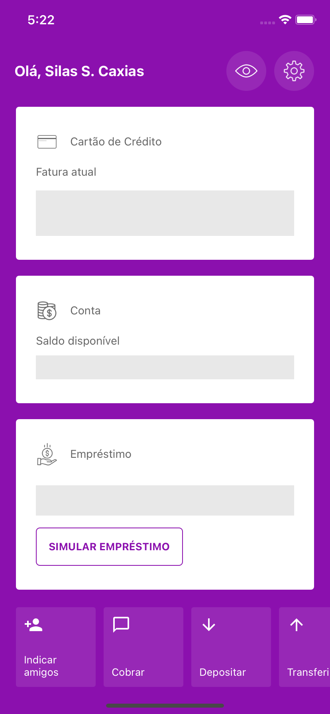

# Nubank Clone

Aplicação com o intuito de criar um clone do menu inicial do aplicativo Nubank utilizando React Native.

## Capturas de Tela

# Pagina inicial

# Pagina inicial - demais items

# Pagina inicial - Ocultar valores ativo

### Bibliotecas

- [Babel Root Import](https://github.com/osvaldokalvaitir/projects-settings/blob/master/nodejs/libs/babel-plugin-root-import.md)

- [babel-eslint](https://github.com/osvaldokalvaitir/projects-settings/blob/master/nodejs/libs/babel-eslint.md)

- [ESLint](https://github.com/osvaldokalvaitir/projects-settings/blob/master/nodejs/libs/eslint.md)

- [ESLint plugin for React Native](https://github.com/osvaldokalvaitir/projects-settings/blob/master/nodejs/libs/eslint-plugin-react-native.md)

- [eslint-import-resolver-babel-plugin-root-import](https://github.com/osvaldokalvaitir/projects-settings/blob/master/nodejs/libs/eslint-import-resolver-babel-plugin-root-import.md)

- [React Native Gesture Handler](https://github.com/osvaldokalvaitir/projects-settings/blob/master/nodejs/libs/react-native-gesture-handler.md)

- [React Native Vector Icons](https://github.com/osvaldokalvaitir/projects-settings/blob/master/nodejs/libs/react-native-vector-icons.md)

- [react-native-cli](https://github.com/osvaldokalvaitir/projects-settings/blob/master/nodejs/libs/react-native-cli.md)

- [react-native-iphone-x-helper](https://github.com/osvaldokalvaitir/projects-settings/blob/master/nodejs/libs/react-native-iphone-x-helper.md)

- [react-native-qrcode-svg](https://github.com/osvaldokalvaitir/projects-settings/blob/master/nodejs/libs/react-native-qrcode-svg.md)

- [styled-components](https://github.com/osvaldokalvaitir/projects-settings/blob/master/nodejs/libs/styled-components.md)
